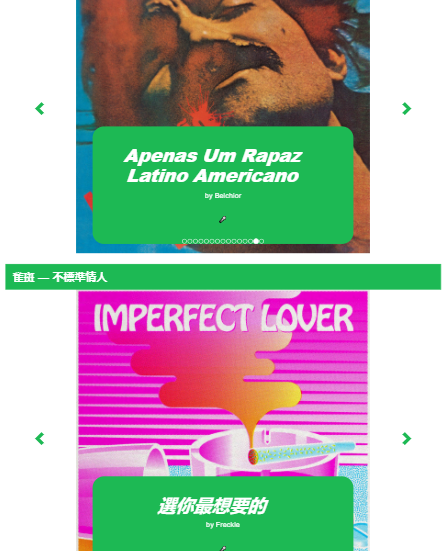
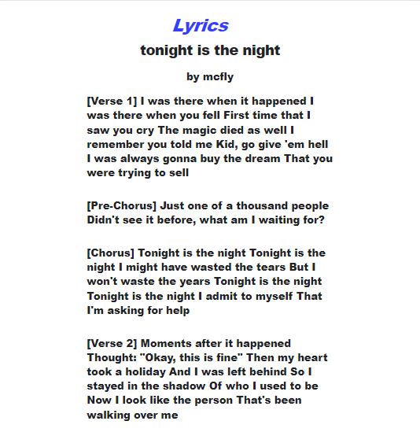

# :notes: SPOTIFYRICS :notes:
Application Node.js qui récupère les playlists de l'utilisateur 
et propose les lyrics de chacune des chansons.

Utilisation de l'API spotify + site Genius.

## Screenshots

## Comment lier son compte spotify ?
Créer un fichier .env avec au moins les variables suivantes: 
- SPOTIFY_CLIENT_ID -> récupérable sur le site spotify API (dans le dashboard)
- SPOTIFY_CLIENT_SECRET -> récupérable sur le site spotify API (dans le dashboard)
- SESSION_SECRET
- PROJECT_DOMAIN -> nom de domaine :warning: Il faut également indiquer cette adresse + '/callback' dans les options des dashboards en tant qu'url de redirection.
- GENIUS_TOKEN -> récupérable avec l'API genius

## lien vers mon appli perso: https://agile-bayou-87039.herokuapp.com/

